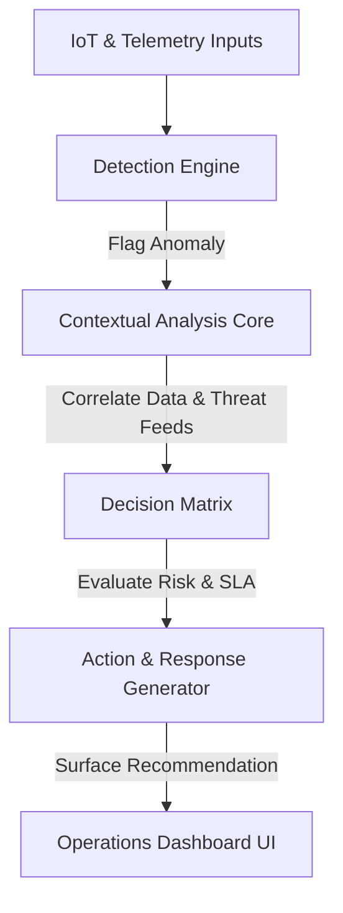

# Aegiscore AI — Autonomous Decision Intelligence MVP

Aegiscore AI is a premium, production-grade autonomous decision-support platform designed for high-stakes operational control rooms. It continuously monitors high-volume data streams (IoT sensors, fleet tracking telemetry, municipal grid metrics), automatically detects anomalies, runs multi-agent contextual logic, generates precise action recommendations, and composes explainable human-in-the-loop audit logs.

Developed for hackathons and operations control demonstrations, the system showcases a minimal, modern SaaS aesthetic, avoiding generic neon cyber cliches in favor of a clean, structured, and content-first UI.

---

## 🚀 Project Pitch & Value Proposition

In high-stakes industries like logistics, municipal utilities, and campus networks, downtime or security failures cost thousands of dollars per minute. Operations teams are often overwhelmed by "alert fatigue"—floods of low-context alarms from disconnected systems.

**Aegiscore AI** solves this by acting as an intelligent operations copilot:
1. **Contextual Ingestion:** Aggregates telemetry from multiple sources.
2. **Autonomous Reasoning:** Evaluates anomalies relative to rolling averages, weather telemetry, threat intelligence feeds, and historical data patterns.
3. **Transparent Decision-making:** Doesn't just suggest actions—it explains *why* through a step-by-step reasoning tree and interactive logs.
4. **Human-in-the-loop Guardrails:** Recommends concrete remediation text and scripts ready for deployment, preserving final approval controls for operators.

---

## 🛠️ Tech Stack & Architecture

- **Core Framework:** Next.js 14 (App Router)
- **Language:** TypeScript
- **Styling:** Tailwind CSS (Custom color scheme, Zinc-based dark mode defaults)
- **Animations:** Framer Motion (Smooth stage transitions, micro-interactions, typed log cursor effects)
- **Icons:** Lucide React
- **Design Tokens:** Hardened HSL colors, clean glassmorphic panels, and consistent typography using Google Fonts (Inter + JetBrains Mono)

### System Pipeline (How It Works)



1. **Detect:** Scans incoming events (e.g. auth requests, pressure metrics, GPS coordinate changes) for anomalous variations.
2. **Analyze:** Inspects related databases, weather maps, and network subnets.
3. **Decide:** Simulates response strategies under SLA/risk guidelines to find the optimal resolution path.
4. **Respond:** Outputs structured logs and copy-pasteable resolution steps.

---

## ✨ Features Built

- **Vibrant Hero Landing Page:** Complete product summary, CTA, structural metrics, features checklist, pipeline explanation, and system architecture schema.
- **Operations Dashboard:**
  - **Live Stats Strip:** Tracks active incidents, resolved issues, high-severity alarms, and average response times.
  - **Categorized Filtering:** Instant client-side filters for severity and status.
  - **Incident Interactive Cards:** Dynamic list representing three unique production-realistic events across network, logistics, and utility verticals.
  - **State-Simulation Engine:** "Run Agent" action moves the selected incident dynamically through `Pending ➔ Analyzing ➔ Resolved` phases.
  - **Live Console Log:** Monospace agent output feed that streams timestamps and color-coded status codes (WARN, INFO, ANLZ, DCSN, EXEC, DONE) in real time.
  - **Horizontal Workflow Timeline:** Visual indicator highlighting which step of the pipeline the agent is executing.
  - **Details Inspection Panel:** Shows confidence metrics, reasoning lists, proposed actions, and the finished response text.

---

## 📁 Project Structure

```text
├── src/
│   ├── app/
│   │   ├── globals.css         # Custom HSL design tokens, custom scrollbars, and fonts
│   │   ├── layout.tsx          # Root layout and metadata header overrides
│   │   ├── page.tsx            # Landing page layout (Hero, Features, Pipeline, Arch, CTA)
│   │   └── dashboard/
│   │       └── page.tsx        # Main live control room UI with status filtering
│   ├── components/
│   │   ├── dashboard/
│   │   │   ├── AgentLog.tsx          # Monospace live console log feed
│   │   │   ├── IncidentDetail.tsx    # Detailed reasoning and recommendation inspect card
│   │   │   ├── IncidentTable.tsx     # Card list of active and resolved incidents
│   │   │   ├── SeverityBadge.tsx     # Clean indicators for critical/high/med/low severity
│   │   │   ├── StatusBadge.tsx       # State indicator badges with status pulse actions
│   │   │   ├── StatsStrip.tsx        # Top operational metric counters
│   │   │   └── WorkflowTimeline.tsx  # Horizontal progress workflow tracker
│   │   ├── landing/
│   │   │   ├── Architecture.tsx      # System architecture component
│   │   │   ├── Features.tsx          # Marketing features grid
│   │   │   ├── Hero.tsx              # Clean landing landing-hero
│   │   │   └── HowItWorks.tsx        # Pipeline explanation cards
│   │   └── layout/
│   │       ├── Navbar.tsx            # Glassmorphism dynamic navigation bar
│   │       └── Footer.tsx            # Clean, compact legal and project footer
│   └── lib/
│       ├── data.ts             # Rich mock incident data
│       ├── hooks.ts            # State machine / simulation hooks for the agent
│       └── utils.ts            # Tailwind merging tools
```

---

## ⚡ Setup & Launch Instructions

### Prerequisites
Make sure you have Node.js (version 18+ recommended) and `npm` installed.

### 1. Install Dependencies
In the root directory of the project, run:
```bash
npm install
```

### 2. Run Locally in Development
Start the local Next.js dev server:
```bash
npm run dev
```
Open [http://localhost:3000](http://localhost:3000) in your browser to inspect the application.

### 3. Build for Production
Verify typescript compilation and create optimized distribution assets:
```bash
npm run build
```

---

## 🔮 Future Roadmap

- **LLM/RAG Integration:** Connect reasoning logs directly to vector stores indexing standard operating procedures (SOPs).
- **Incident Playbooks:** Allow operators to design and deploy custom event-response rules visual workflow builders.
- **Role-Based Access (RBAC):** Integrate enterprise authentication to log which engineer approved each autonomous agent decision.
- **WebSocket Feeds:** Switch mock hooks to listen to genuine pub-sub networks (Kafka, AWS EventBridge).
